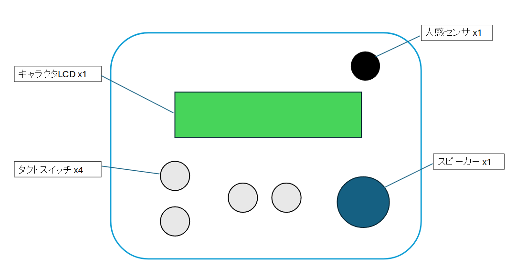
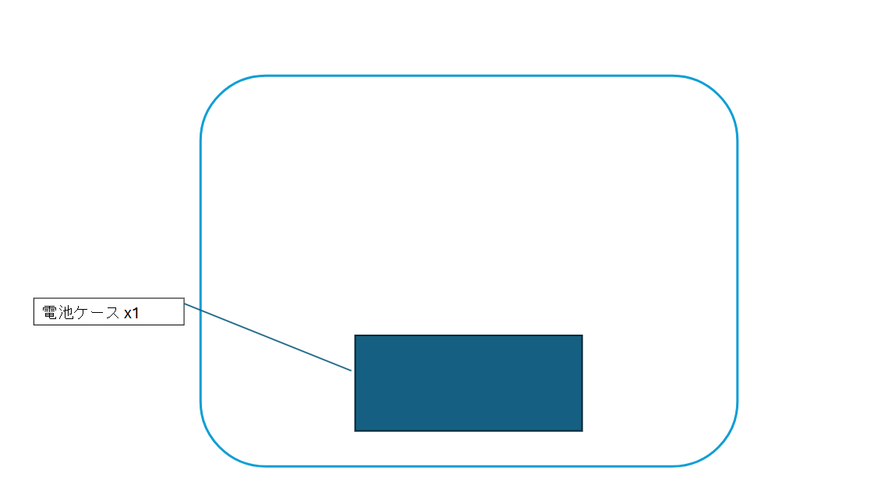
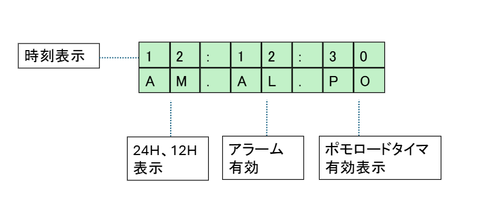

# 目的
時計をウォーターフォールで開発し、
ソフトウェアとハードウェアの基礎を学ぶこと。

# 機能要求

## 筐体構成
- 筐体のサイズは横20cm、縦15cm以内とする
- キャラクタLCD×1
- タクトスイッチ×4
   - 上ボタン
   - 下ボタン
   - セット1ボタン
   - セット2ボタン
- スピーカー ×1
- 人感センサ ×1

### 構成図

図1　筐体表面の構成図

図2　筐体裏面の構成図

## 時刻機能の要件
- RTCを使用し、時刻を計算する。
- 時刻の月差は60秒/月とする。

## 時計表示の要件
- 8x2サイズのLCDに表示する。

図3　LCD画面構成

1行目には時刻を表示する。
2行目にはAM/PM、アラームON/OFF、ポモロードタイマーON/OFF情報を表示する。
1行目には時刻を表示する  

## 時刻表示切り替え機能
- 上ボタンにより24時間表示と12時間表示を切り替える
   - 電源投入時は24時間表示
   - 24時間表示の時、LCDの2行目に24と表示
   - 12時間表示の時、LCDの2行目にAmまたはPMと表示
   
## 画面構成
 

## ボタン要件

## アラーム機能
## ポモロードタイマー機能
## バックライト制御
## 人感センサ要件
## スピーカー要件
- 出力は60-80dbであること

# 非機能要求
- 電池駆動で1か月駆動可能